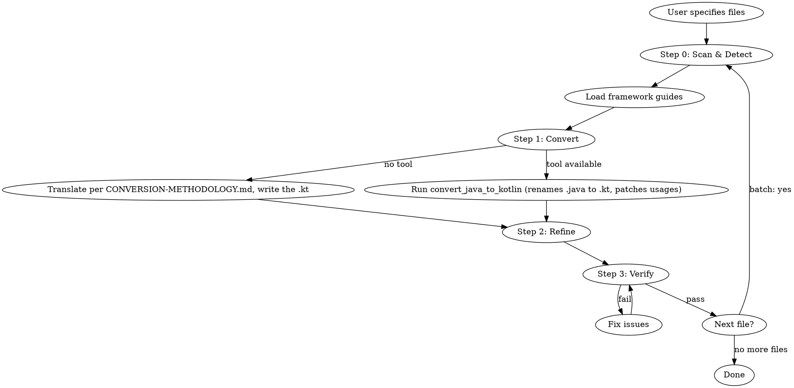

# Java to Kotlin Conversion

Convert Java source to idiomatic Kotlin — using a static IDE converter when one is available, otherwise a
disciplined manual methodology — with framework-aware refinement and API preservation.

## Workflow

## Step 0: Scan & Detect Frameworks

Before converting, scan the Java file's import statements to detect which frameworks
are in use. Load ONLY the matching framework reference files to keep context focused.

### Framework Detection Table

| Import prefix | Framework guide |
|---|---|
| `org.springframework.*` | [SPRING.md](references/frameworks/SPRING.md) |
| `lombok.*` | [LOMBOK.md](references/frameworks/LOMBOK.md) |
| `javax.persistence.*`, `jakarta.persistence.*`, `org.hibernate.*` | [HIBERNATE.md](references/frameworks/HIBERNATE.md) |
| `com.fasterxml.jackson.*` | [JACKSON.md](references/frameworks/JACKSON.md) |
| `io.micronaut.*` | [MICRONAUT.md](references/frameworks/MICRONAUT.md) |
| `io.quarkus.*`, `javax.enterprise.*`, `jakarta.enterprise.*` | [QUARKUS.md](references/frameworks/QUARKUS.md) |
| `dagger.*`, `dagger.hilt.*` | [DAGGER-HILT.md](references/frameworks/DAGGER-HILT.md) |
| `io.reactivex.*`, `rx.*` | [RXJAVA.md](references/frameworks/RXJAVA.md) |
| `org.junit.*`, `org.testng.*` | [JUNIT.md](references/frameworks/JUNIT.md) |
| `com.google.inject.*` | [GUICE.md](references/frameworks/GUICE.md) |
| `retrofit2.*`, `okhttp3.*` | [RETROFIT.md](references/frameworks/RETROFIT.md) |
| `org.mockito.*` | [MOCKITO.md](references/frameworks/MOCKITO.md) |

`javax.inject.*` and `jakarta.inject.*` (`@Inject`, `@Named`, `@Singleton`, `@Qualifier`) are generic DI
annotations shared by Dagger/Hilt, Guice, Spring, Micronaut, and Quarkus/CDI — they do **not** identify a
framework on their own. Determine the real framework from the other imports in the file (e.g.
`com.google.inject.*` → Guice, `dagger.*` → Dagger/Hilt, `io.micronaut.*` → Micronaut, `org.springframework.*`
→ Spring) and load that guide. If several match, load each; if none do, treat it as plain JSR-330 DI and
apply constructor injection without a framework-specific guide.

## Step 1: Convert

Produce the Kotlin. **Prefer a static IDE converter** (in JetBrains IDEs, the MCP tool
`convert_java_to_kotlin`) — check your available tools:

- **Available:** call `convert_java_to_kotlin` on the target file(s). It converts deterministically (real
  type/nullability inference, import fixing), renames `.java`→`.kt` in place, and patches references to the
  converted declarations across the whole project; it returns the produced `.kt` path(s). The rename is
  the tool's job — do not rename beforehand, it only accepts `.java` input.
- **Not available, or the call fails:** translate the Java yourself, following
  [references/CONVERSION-METHODOLOGY.md](references/CONVERSION-METHODOLOGY.md), then write the `.kt` and
  delete the `.java`.

Fix any Java syntax errors before converting — the converter needs a parseable source. If
`convert_java_to_kotlin` reports that Kotlin is not configured in the target module, stop and ask the
user to configure Kotlin first.

## Step 2: Refine

Refine the Kotlin per [references/REFINEMENT.md](references/REFINEMENT.md), then check the result
against [references/KNOWN-ISSUES.md](references/KNOWN-ISSUES.md) — keyword clashes, SAM ambiguity,
platform types, statics, checked exceptions, arrays, try-with-resources.

Do **not** re-translate: Step 1 already did the structural conversion.

## Step 3: Verify

Verify using [assets/checklist.md](assets/checklist.md):
- compile the converted file — `build_project`, or `lint_files` on the changed files for a faster check
- run existing tests
- check annotation site targets
- confirm no behavioral changes

If verification fails, fix and re-verify.

## Batch Conversion

### With the IDE tool

Detect frameworks for **every** file first (Step 0) — the tool renames `.java` → `.kt` in place, so the
Java imports are gone once it has run.

Then pass **all** the related files to `convert_java_to_kotlin` in one call — it converts them together
and patches cross-file usages project-wide, so you don't dependency-order or hand-fix cross-references.
Every file in a single call must belong to the **same module** — batch per module, one call each.

Then work per file: refine (Step 2) → verify (Step 3).

### Without the IDE tool

Convert one file at a time:

1. **List all `.java` files** in the target scope
2. **Sort by dependency order** — convert leaf dependencies first (files that don't
   import other files in the conversion set), then work up to files that depend on them
3. **Convert one file at a time** — apply the per-file workflow (Steps 0–3: detect → translate → refine
   → verify) for each
4. **Track progress** — report which files are done, which remain
5. **Handle cross-references** — after converting a file, update imports in other Java
   files if needed (e.g., if a class moved packages)

For large batches, convert in packages (bottom-up from leaf packages).
